<h1 id="top" align="center">
  Hi, I'm Likitha Reddy 👋
</h1>

<p align="center">
  <a href="https://git.io/typing-svg">
    
  </a>
</p>

<p align="center">
  
  
  
</p>

<p align="center">
  <a href="https://www.linkedin.com/in/tapasi-likitha-reddy/">
    
  </a>
  <a href="mailto:tapasilikithareddy@gmail.com">
    
  </a>
  <a href="https://github.com/tapasilikithareddy">
    
  </a>
</p>

---

<div align="center">

<span>[<kbd> <br> About <br> </kbd>](#about)</span>
<span>[<kbd> <br> Socials <br> </kbd>](#social-media)</span>
<span>[<kbd> <br> Skills <br> </kbd>](#technical-skills)</span>
<span>[<kbd> <br> Projects <br> </kbd>](#featured-projects)</span>
<span>[<kbd> <br> Education <br> </kbd>](#education)</span>
<span>[<kbd> <br> Stats <br> </kbd>](#github-stats)</span>

</div>

---

<h2 id="about">
  👩‍💻 About Me
</h2>


- 💻 Software Engineer with a strong foundation in software development.
- 🎓 B.Tech in Computer Science & Engineering.
- 🐍 Interested in Python development and backend technologies.
- ☕ Familiar with Java and object-oriented programming.
- 🌐 Interested in Full Stack Web Development.
- 🤖 Exploring AI, Machine Learning, and RAG applications.
- ☁️ Learning Cloud technologies and deployment.
- 🗄️ Comfortable working with SQL and databases.
- 🚀 Enjoy building practical projects and learning new technologies.
- 🔍 Interested in solving real-world software engineering problems.
- 📚 Continuously improving my technical and problem-solving skills.

<br clear="right"/>

---

<h2 id="social-media">
  🌐 Social Media
</h2>

<p align="center">

<a href="https://www.linkedin.com/in/tapasi-likitha-reddy/" target="_blank">
  
</a>

<a href="mailto:tapasilikithareddy@gmail.com" target="_blank">
  
</a>

<a href="https://github.com/tapasilikithareddy" target="_blank">
  
</a>

</p>

---

<h2 id="technical-skills">
  💻 Technical Skills
</h2>

<h3>🐍 Programming Languages</h3>

<p>
  
  
</p>

<h3>🌐 Web Development</h3>

<p>
  
  
  
  
  
  
</p>

<h3>🤖 AI & Machine Learning</h3>

<div>
  

  <div>
    
    
    
    
  </div>

  <div>
    
    
    
  </div>
</div>

<div style="clear: both;"></div>

<h3>🗄️ Databases</h3>

<p>
  
  
</p>

<h3>☁️ Cloud & DevOps</h3>

<p>
  
  
  
  
</p>
<h3>⚙️ Tools</h3>

<p>
  
</p>

<h3>☁️ Salesforce</h3>

<p>
  
  
  
  
</p>


---

<h2 id="featured-projects">
  🚀 Featured Projects
</h2>

<table>
<tr>
<td width="50%" valign="top">

<h3>🤖 Chat with PDF & Website — RAG Pipeline</h3>

<p>
A Retrieval-Augmented Generation application that allows users to process information from PDF documents and websites and interact with the retrieved content.
</p>

<p><b>Tech:</b> Python • Streamlit • LangChain • FAISS • Sentence Transformers</p>

<p>
<a href="https://github.com/tapasilikithareddy/Chat-with-PDF-and-Website-Using-RAG-Pipeline">
  🔗 View Project
</a>
</p>

</td>

<td width="50%" valign="top">

<h3>📋 Team Task Manager</h3>

<p>
A full-stack task management application built with Flask that supports authentication, role-based access, project creation, task assignment, and task tracking.
</p>

<p><b>Tech:</b> Python • Flask • HTML • CSS • SQLite</p>

<p>
<a href="https://github.com/tapasilikithareddy/team-task-manager">
  🔗 View Project
</a>
</p>

</td>
</tr>

<tr>
<td width="50%" valign="top">

<h3>💰 Personal Finance Management System</h3>

<p>
A full-stack application designed to help users manage and organize their personal financial information.
</p>

<p><b>Tech:</b> JavaScript • Java • HTML • CSS</p>

<p>
<a href="https://github.com/tapasilikithareddy/Personal-Finance-Management-System">
  🔗 View Project
</a>
</p>

</td>

<td width="50%" valign="top">

<h3>🍎 Apple Website Clone</h3>

<p>
An interactive Apple-inspired website featuring 3D elements, animations, and responsive design.
</p>

<p><b>Tech:</b> React • Three.js • GSAP • JavaScript</p>

<p>
<a href="https://github.com/tapasilikithareddy/Apple-Website-Clone-with-React-Three.js-GSAP">
  🔗 View Project
</a>
</p>

</td>
</tr>

<tr>
<td width="50%" valign="top">

<h3>🔐 Secure Data Hiding in Image</h3>

<p>
A Python-based steganography project for hiding and extracting information within images while maintaining visual integrity.
</p>

<p><b>Tech:</b> Python • OpenCV • NumPy • Pillow • Tkinter</p>

<p>
<a href="https://github.com/tapasilikithareddy/Secure-Data-Hiding-in-Image">
  🔗 View Project
</a>
</p>

</td>

<td width="50%" valign="top">

<h3>📊 Customer Segmentation using K-Means</h3>

<p>
A machine learning project that segments customers based on demographic and spending behavior using K-Means clustering.
</p>

<p><b>Tech:</b> Python • Pandas • NumPy • Scikit-learn • Matplotlib</p>

<p>
<a href="https://github.com/tapasilikithareddy/Customer-Segmentation-KMeans">
  🔗 View Project
</a>
</p>

</td>
</tr>
</table>

---

<h2 id="education">
  🎓 Education
</h2>

### Bachelor of Technology — Computer Science & Engineering

**Sree Vidyanikethan Engineering College**

2021 – 2025

**CGPA:** 8.73 / 10

---

<h2>
  📜 Certifications & Learning
</h2>

- 🏆 Salesforce Platform Developer I
- 🏆 Salesforce Administrator
- ☁️ AWS Academy Cloud Foundations
- ☁️ Google Cloud Foundations
- 📚 IBM SkillsBuild
- 📚 Coursera
- 📚 Infosys Springboard

---

<h2>
  🌱 Currently Learning
</h2>

```text
🌱 2026 LEARNING PATH
│
├── 🤖 AI & GENERATIVE AI              ├── 💻 FULL STACK
│   ├── Generative AI                  │   ├── Python → FastAPI
│   ├── RAG + Vector DB                │   ├── Java → Spring Boot
│   ├── LLM Applications               │   ├── TypeScript → React
│   └── AI Agents                      │   └── REST APIs
│
├── ☁️ CLOUD & DEVOPS                  └── 🧠 ENGINEERING
│   ├── AWS                                ├── System Design
│   ├── Docker                             ├── DSA
│   └── CI/CD                              └── Testing & Debugging
│
└── 🚀 BUILD → LEARN → IMPROVE → REPEAT
```
---

<h2 id="github-stats">
  📊 GitHub Metrics
</h2>

<table>
<tr>
<td width="50%">


</td>
<td width="50%">


</td>
</tr>

<tr>
<td width="50%">


</td>
<td width="50%">


</td>
</tr>
</table>

---

<h2>
  💡 My GitHub Philosophy
</h2>

<p align="center">

<b>Learn → Build → Debug → Improve → Repeat 🚀</b>

</p>

---

<h2>
  🤝 Let's Connect
</h2>

<p>
  I'm always interested in learning, building projects, and connecting with other developers.
</p>

<p>
  <a href="https://www.linkedin.com/in/tapasi-likitha-reddy/">
    
  </a>
  <a href="mailto:tapasilikithareddy@gmail.com">
    
  </a>
</p>

---

<p align="center">
  ✨ Thanks for visiting my GitHub profile! ✨
</p>

<p align="center">
  <i>Build • Learn • Improve • Repeat 🚀</i>
</p>

<p align="center">
  <a href="#top">
    
  </a>
</p>

---

<h2 id="guest-book">
  📖 Guest Book
</h2>

- Leave a message [Here](https://github.com/tapasilikithareddy/tapasilikithareddy/issues/new?template=guestbook-entry.md)


